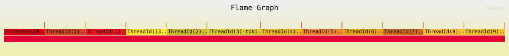

Zero-Copy RESP Datastore Engine

An in-memory, zero-copy datastore built entirely from scratch in asynchronous Rust. It implements RESP (the REdis Serialization Protocol) and is designed to bypass standard operating system bottlenecks to safely handle massive concurrent loads.

This project is not a tutorial clone. It is the documentation of a four-month descent into systems programming, CPU architecture, lock contention, OS page caches, and idiomatic Rust.

Peak Benchmarked Throughput: 1,096,491 GET/s and 803,858 SET/s (Pipelined, TCP_NODELAY active).

Running the Engine & Benchmarks
Clone the repository and boot the server in release mode (compiler optimizations are mandatory for these metrics):


```bash
git clone https://github.com/tsrisabari/zero-copy-resp-datastore-engine.git
cd zero-copy-resp-datastore-engine
cargo run --release
```

To verify the 1 Million RPS throughput:

In a separate terminal, use standard redis-benchmark to hit the server with 100 concurrent connections, pipelining 100 requests per TCP packet to bypass OS wakeups:

```bash
redis-benchmark -p 6379 -t set,get -n 500000 -c 100 -r 1000000 -P 100 -q
```

Core Architecture & Mechanical Sympathy

This datastore achieves its speed by ruthlessly eliminating heap allocations and isolating thread locks to the microsecond level.

64-Way Hash-Sharded Vault: Global RwLocks starve Tokio worker threads. By hashing keys into 64 independent shards, 100 concurrent clients can read and write simultaneously without forming single-file wait queues. Lock drop scopes ({ }) are strictly enforced, reducing thread block times to ~90 - 400 nanoseconds.

True Zero-Copy Network Boundary: The engine does not allocate String types in the hot path. It ingests raw TCP streams into a bytes::BytesMut buffer. The parser uses an in-memory cursor to identify frames, calling .split_to().freeze() to pass lightweight 8-byte smart pointers into the core engine.

Detached Atomic Compaction (AOF): Writing every command to disk causes infinite log bloat. A detached Tokio background worker wakes up every 30 seconds, creates a volatile temp_aof snapshot of the active RAM state, and uses the POSIX rename syscall (ExecuteAtomicSwap) to replace the active Write-Ahead Log. This collapses 11MB of disk bloat down to 450 bytes in a single microsecond without dropping a single active TCP connection.

Decoupled MPSC Persistence: Disk I/O is physically separated from the network loop. Commands are passed through a bounded mpsc channel (100,000 capacity). A background worker drains this channel into the Linux Kernel Page Cache, allowing the network to process requests at pure RAM speed.

The Engineering Devlog
This project was built through brutal trial and error. Here is the documentation of how my mental models broke and evolved as I pushed the hardware to its limits.

Week 1: Memory Vaults & The Zero-Copy Shift

The Misunderstanding: I initially thought related data needed to be stored together in JSON-like structs. I quickly realized that flat Key-Value namespacing is vastly superior for write latency because it avoids parsing and rewriting entire nested objects.
The Breakthrough: Transitioning from String to Bytes. I realized I am not actually moving data around the application; I am moving 8-byte fat pointers. Eliminating .clone() across the network boundary was my first lesson in memory physics.

Week 2: TCP Physics & The I/O Hostage Situation

The Eye-Opener: TCP is a stream of water, not a conveyor belt of neat packages. Handling fragmented packets completely changed how I view network buffers. I had to build a parser that correctly yields Ok(None) to instruct Tokio's Framed stream to wait for more physical bytes before executing.
The I/O Trap: I realized a massive flaw in my early architecture: I was writing to the physical SSD before returning the +OK response to the client. I was holding the Tokio event loop hostage to the speed of my NAND flash, completely neutralizing my RAM speed.

Week 3: Nagle's Algorithm & The OS Border Crossing

The 5,000 RPS Ceiling: I hit a hard wall. No matter how much I optimized my code, throughput wouldn't pass 5k. I realized the Linux kernel was artificially holding my packets using Nagle's Algorithm. Activating TCP_NODELAY bypassed the OS buffer, instantly shooting throughput to 60,000+ RPS.
The Physics of Disk Writes: I learned the vital distinction between write_all(), flush(), and sync_data(). I realized that flush() only moves data from my Rust app to the Linux Kernel Page Cache. To actually survive a power failure, I had to force the OS to trigger fdatasync() to burn the bytes into physical silicon.

Week 4: The 1 Million RPS Barrier & Observability

The Terminal Chokehold: While load-testing, the Tokio reactor completely stalled. The bottleneck wasn't my database; it was the stdout terminal logger. Writing INFO logs to the screen was consuming all CPU cycles. Shifting the tracing subscriber to WARN instantly unlocked the engine's true capacity, pushing it past 1,000,000 requests per second.
Fuzzing & Flamegraphs: I hardened the RESP parser against single-token command panics (like PING and CONFIG) using proptest property-based fuzzing. To mathematically prove my lock sharding worked, I instrumented the runtime with tracing-flame, generating an SVG flamegraph that confirmed zero vertical lock-wait towers during a 100k pipelined load.

Below is the execution profile under a 100,000 pipelined request workload:

[](perf-profile.svg)

> **Note:** Click the image to open the raw SVG in your browser for interactive frame inspection and zooming.

The Road Ahead
This engine is feature-complete for its original scope, but the journey into low-level infrastructure is just starting.

I built this to prove I can manage memory safely, understand asynchronous state engines, and write idiomatic Rust that respects underlying hardware constraints. I am actively seeking remote B2B contracting roles or systems engineering positions at infrastructure companies (such as Turso, Qdrant, or similar database/edge environments) where high-performance, mechanical sympathy is required.

If you are a senior systems engineer, a Rustacean, or a team looking for a disciplined low-level developer:
Let's connect on [](https://www.linkedin.com/in/sri-sabari-t-62b989427). Just mention you saw this repository.
